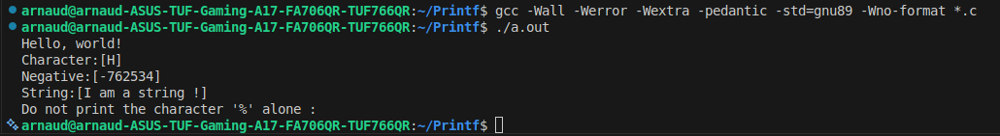

 holbertonschool-printf

##  C project - _printf function implementation
- This project is a custom implementation of the `printf` function in C, designed to mimic the behavior of the standard library's `printf`.
- The project focuses on understanding variadic functions, format specifiers, and string manipulation in C.

### Features
- Supports various format specifiers including `%c`, `%s`, `%d`, `%i`.
- Handles edge cases such as NULL strings and unsupported format specifiers.

### Usage
- To use the `_printf` function, include the header file `main.h` in your C program.
- Call the `_printf` function with a format string and corresponding arguments.


### Example
```c
#include "main.h"

int main(void)
{
    _printf("Hello, %s!\n", "world");
    _printf("Character:[%c]\n", 'H');
    _printf("Negative:[%d]\n", -762534);
    _printf("String:[%s]\n", "I am a string !");
    _printf("Do not print the character '%' alone :\n");
    _printf("%");
    return (0);
}
```
### Screenshot


### Compilation
- Compile the project using `gcc` with the following command:
- gcc -Wall -Werror -Wextra -pedantic -std=gnu89 -Wno-format *.c
### Files
- `main.h`: Header file containing function prototypes and necessary includes.
- `printf.c`: Implementation of the `_printf` function.
- `functions.c`: Helper functions for handling different format specifiers.
### Author
- Pemjean Arnaud
- Roussel James
### License
- This project is licensed under the MIT License.
